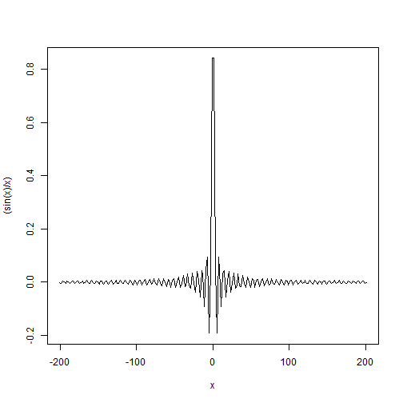

## Example plot showing sinc function.


```r
x <- seq(-201,201,2)
plot(x, (sin(x)/x), type='l')
```



---
## Using the app

While taking images, say of a head, in an MRI scanner, we generally acquire 2D slices of the brain and represent them as images. To obtain these rectangular slices, it is important to use rectangular frequency profiles. The app shows some typical frequency profiles for commonly used input RF waveforms. 

1. Select the desired input RF signal from the dropdown listbox. 
2. Adjust the zoom slider which controls the display of the fourier transform.

The application displays the selected input's real and imaginary waveforms as the first two graphs. The third graph displays the magnitude of the fourier transform for the input signal. 

By default, the app is set to receive a gaussian function as an input.
